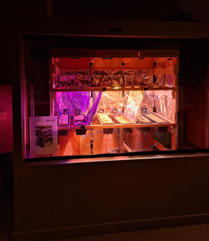

[**Home**](https://klaasmeersman.github.io/) - [**LEDs and PCB**](/inhoud/leds/) - [**LED Control and Sources**](/inhoud/aansturingLEDs/) - [**Energy Monitoring**](/inhoud/energiemonitoring/) - [**Water Supply**](/inhoud/aquaMonitoring/) - [**Dashboard**](/inhoud/dashboard/) - [**Modularity**](/inhoud/modulariteit/) - [**Plant Sensing**](/inhoud/plantensensor/) - [**Operation**](/inhoud/operation/) - [**Logbook**](/inhoud/logboek/)

---

