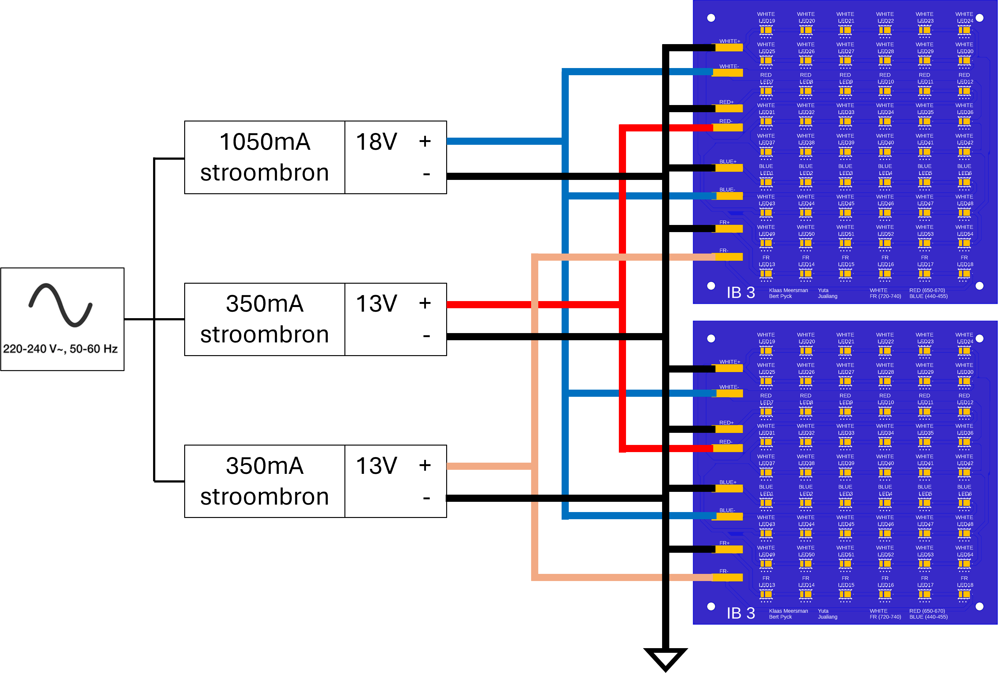
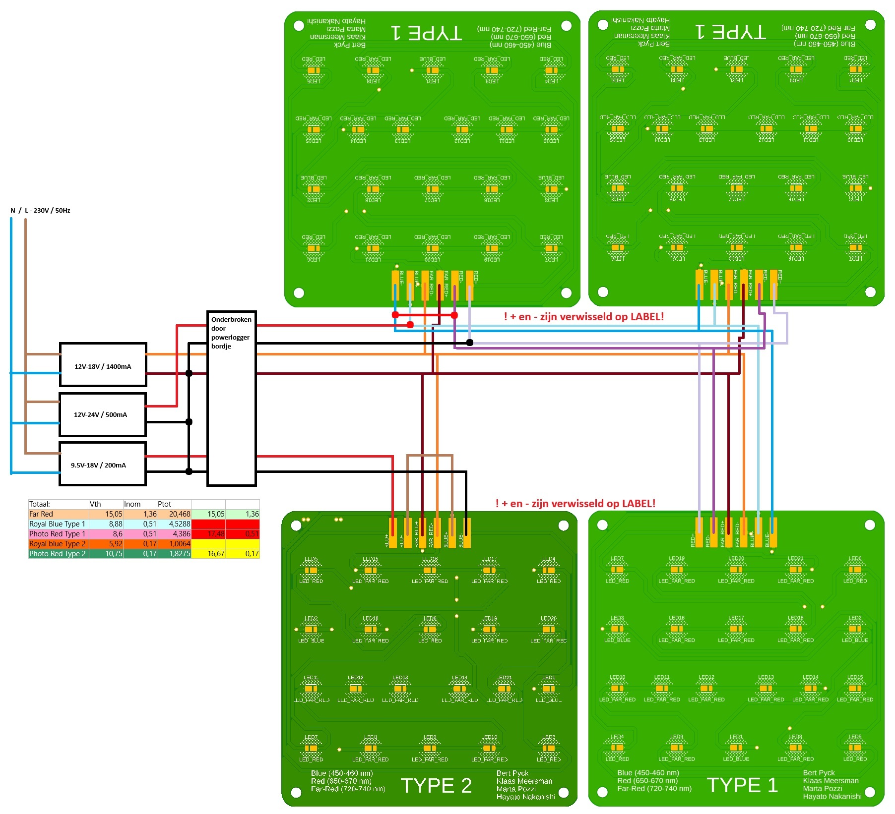

[**Home**](https://klaasmeersman.github.io/) - [**LEDs and PCB**](/inhoud/leds/) - [**LED-aansturing en bronnen**](/inhoud/aansturingLEDs/) - [**Energiemonitoring**](/inhoud/energiemonitoring/) - [**Watervoorziening**](/inhoud/aquaMonitoring/) - [**Dashboard**](/inhoud/dashboard/) - [**Modulariteit**](/inhoud/modulariteit/) - [**Plantsensing**](/inhoud/plantensensor/) - [**Operation**](/inhoud/operation/) - [**Logboek**](/inhoud/logboek/)

---

# Rechter LED-array: Yuta en Jualiang
Deze LED-array bestaat uit twee identieke [PCB's](../leds/index.md) die parallel gevoed worden.

Deze LED-array wordt gevoed door [1 stroombron van 1050mA](https://www.mouser.be/ProductDetail/MEAN-WELL/LPC-60-1050?qs=O2yOKspD61CwHxEZesuS%2Fw%3D%3D) en [2 stroombronnen van 350mA](https://www.mouser.be/ProductDetail/MEAN-WELL/APC-12-350?qs=DNaZHaGatO0h%2FjPDgBoC1g%3D%3D).

- De 72 witte en 12 blauwe LED's worden gevoed door de 1050mA bron omdat hun doorlaatspanning vergelijkbaar is (Vf~wit~ = 2,85V, Vf~blauw~ = 3V).
    - Elke witte LED heeft 3V (omdat deze parallel staat met de blauwe LED's) en en een stroom van 75mA. Het vermogen dat door de witte LED's gaat is dus (3V * 0,075A * 72 =) 16,2W.
    - Elke blauwe LED heeft een doorlaatspanning van 3V en 75mA. Het vermogen dat door de blauwe LED's gaat is dus (3V * 0,075A * 12 =) 2,7W.

- De 12 rode LED's worden gevoed door 1 stroom bron van 350mA. Deze voedt de rode LED's op de twee PCB's parallel. Elke rode LED heeft een doorlaatspanning van 2,15V en een stroom van 175mA. Het vermogen dat door de rode LED's gaat is dus (2,15V * 0,175A * 12 =) 4,5W.

- De 12 far red LED's worden gevoed door 1 stroombron van 350mA. Deze voedt de infrarood LED's op de twee PCB's parallel. Elke infrarood LED heeft een doorlaatspanning van 2,15V en en een stroom van 175mA. Het vermogen dat door de far red LED's gaat is dus (2,15V * 0,175A * 12 =) 4,5W.

Het totale stroomverbruik is theoretisch 27,9W wanneer ze aan staan.

Merk op dat de plus klem van de stroombron telkens verbonden wordt met de min pad op het bord. Dit komt door een fout bij het ontwerpen van de LED-component in het PCB design.
De bedrading gebeurt als volgt:

---

# Midden LED-array: M𝔲ήeeв

Deze LED-array bestaat uit twee identieke [PCB's](../leds/index.md) die parallel gevoed worden.

Deze LED-array bestaat uit twee identieke PCB's die parallel gevoed worden (zie in LED en PCB voor schema's van de PCB's) [2 stroombronnen van 1400mA](https://www.mouser.be/ProductDetail/MEAN-WELL/LPC-60-1400?qs=O2yOKspD61Aj4Vv%2BmwlI7Q%3D%3D) en [1 stroombron van 1050mA](https://www.mouser.be/ProductDetail/MEAN-WELL/LPC-60-1050?qs=O2yOKspD61CwHxEZesuS%2Fw%3D%3D).

- De 72 rode LED's worden gevoed door 1 stroom bron van 1400mA. Deze voedt de rode LED's op de twee PCB's parallel. Elke rode LED heeft 350mA die er doorheen gaat. Elke rode LED heeft een doorlaatspanning van 2,09V en een stroom van350mA. Het vermogen dat door de rode LED's gaat is dus (2,09V * 0,35 A * 72 =) 53W.
- De 24 witte LED's worden gevoed door 1 stroom bron van 1400mA. Deze voedt de witte LED's op de twee PCB's parallel. Elke witte LED heeft een doorlaatspanning van 2,8V en een stroom van 700mA. Het vermogen dat door de witte LED's gaat is dus (2,8V * 0,7 A * 24 =) 47W.
- De 24 blauwe LED's worden gevoed door 1 stroom bron van 1050mA. Deze voedt de blauwe LED's op de twee PCB's parallel. Elke blauwe LED heeft een doorlaatspanning van 3V en een stroom van 175mA. Het vermogen dat door de blauwe LED's gaat is dus (3V * 0,175 A * 24 =) 12,6W.

Het totale stroomverbruik is theoretisch 112,6W wanneer ze aan staan.

De bedrading gebeurt als volgt:

---

# Linker LED-array: Marta Pozzi en Hayato Nakanishi

Deze LED-array bestaat uit 4 [PCB's](../leds/index.md): x3 type1 en x1 type2.

Deze LED-array wordt gevoed door 1 stroombron van 200mA, [1 stroombron van 500mA](https://www.mouser.be/ProductDetail/RECOM-Power/RACT12-500?qs=gt1LBUVyoHnLAK5OjzGrww%3D%3D) en [1 stroombron van 1400mA](https://www.mouser.be/ProductDetail/MEAN-WELL/PCD-25-1400B?qs=%2F%2Bo%2FYLy8OFqnTDCUJjd14g%3D%3D).

Er zijn 11 blauwe LED's, 17 rode en 55 far-red.

Vermogen dissipatie:
- blauw: 6,2W
- rood 5,5W
- infrarood 20,5W

Het totale stroomverbruik is theoretisch 32,2W wanneer ze aan staan.

De bedrading gebeurt als volgt:

# Aansturen van de LED-bronnen
De LED-bronnen worden aangestuurd door een controller board(POWERLOGGER, LEDs SWITCH board).

<iframe src="PowerloggerBrd.pdf" width="100%" height="600px"></iframe>

De aansturing gebeurd door de stroom van de verschillende stroombronnen te onderbreken of door te laten met een relais. Deze is aangestuurd door een MOSFET die op zijn beurt is aangestuurd door een ESP32.

[Files](https://github.com/KlaasMeersman/KlaasMeersman.github.io/tree/main/inhoud/energiemonitoring/PCBs%20Bert%20(Type1%2C%20Type2%2C%20Powerlogger)/PowerLogger)

 Deze PCB wordt ook gebruikt voor de [vermogingsmetingen](../energiemonitoring/index.md).
