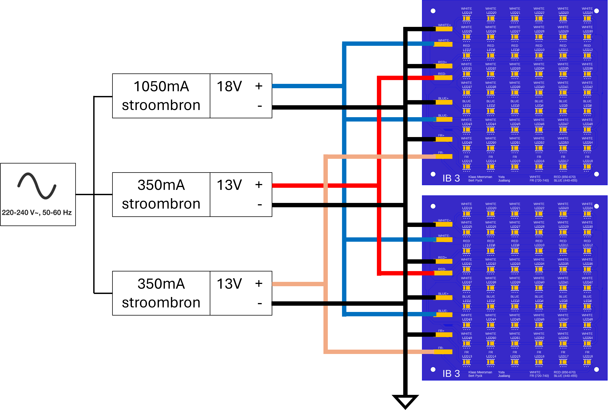
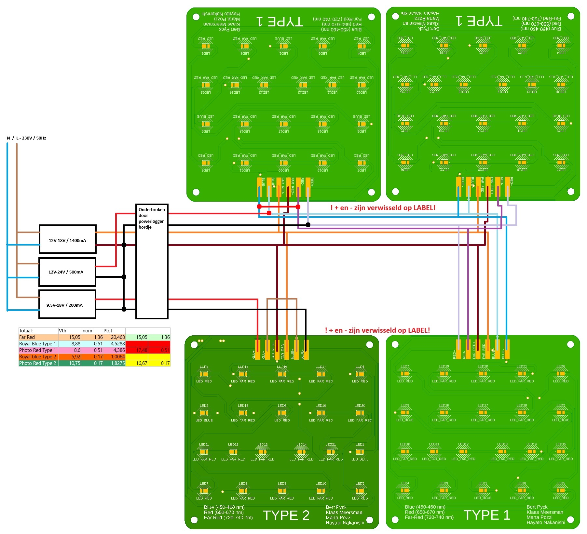

[**Home**](https://verticalfarmib3.github.io/) - [**LEDs and PCB**](/inhoud/leds/) - [**LED Control and Sources**](/inhoud/aansturingLEDs/) - [**Energy Monitoring**](/inhoud/energiemonitoring/) - [**Water Supply**](/inhoud/aquaMonitoring/) - [**Dashboard**](/inhoud/dashboard/) - [**Modularity**](/inhoud/modulariteit/) - [**Plant Sensing**](/inhoud/plantensensor/) - [**Operation**](/inhoud/operation/) - [**Logbook**](/inhoud/logboek/)

---

# Right LED Array: Yuta and Jualiang
This LED array consists of two identical [PCBs](../leds/index.md) that are powered in parallel.

This LED array is powered by [one 1050mA constant current source](https://www.mouser.be/ProductDetail/MEAN-WELL/LPC-60-1050?qs=O2yOKspD61CwHxEZesuS%2Fw%3D%3D) and [two 350mA constant current sources](https://www.mouser.be/ProductDetail/MEAN-WELL/APC-12-350?qs=DNaZHaGatO0h%2FjPDgBoC1g%3D%3D).

- The 72 white and 12 blue LEDs are powered by the 1050mA source because their forward voltages are comparable (Vf~white~ = 2.85V, Vf~blue~ = 3V).
    - Each white LED has 3V (as they are in parallel with the blue LEDs) and a current of 75mA. The power through the white LEDs is therefore (3V * 0.075A * 72 =) 16.2W.
    - Each blue LED has a forward voltage of 3V and 75mA. The power through the blue LEDs is therefore (3V * 0.075A * 12 =) 2.7W.

- The 12 red LEDs are powered by one 350mA power source. This powers the red LEDs on the two PCBs in parallel. Each red LED has a forward voltage of 2.15V and a current of 175mA. The power through the red LEDs is therefore (2.15V * 0.175A * 12 =) 4.5W.

- The 12 far-red LEDs are powered by one 350mA power source. This powers the infrared LEDs on the two PCBs in parallel. Each infrared LED has a forward voltage of 2.15V and a current of 175mA. The power through the far-red LEDs is therefore (2.15V * 0.175A * 12 =) 4.5W.

The total power consumption is theoretically 27.9W when they are on.

Note that the positive terminal of the power source is connected to the negative pads on the board. This is due to an error in designing the LED component in the PCB design.
The wiring is as follows:

---

# Middle LED Array: M𝔲ήeeв

This LED array consists of two identical [PCBs](../leds/index.md) that are powered in parallel.

This LED array consists of two identical PCBs that are powered in parallel (see LEDs and PCB for schematics of the PCBs) [two 1400mA constant current sources](https://www.mouser.be/ProductDetail/MEAN-WELL/LPC-60-1400?qs=O2yOKspD61Aj4Vv%2BmwlI7Q%3D%3D) and [one 1050mA constant current source](https://www.mouser.be/ProductDetail/MEAN-WELL/LPC-60-1050?qs=O2yOKspD61CwHxEZesuS%2Fw%3D%3D).

- The 72 red LEDs are powered by one 1400mA power source. This powers the red LEDs on the two PCBs in parallel. Each red LED has 350mA going through it. Each red LED has a forward voltage of 2.09V and a current of 350mA. The power through the red LEDs is therefore (2.09V * 0.35A * 72 =) 53W.
- The 24 white LEDs are powered by one 1400mA power source. This powers the white LEDs on the two PCBs in parallel. Each white LED has a forward voltage of 2.8V and a current of 700mA. The power through the white LEDs is therefore (2.8V * 0.7A * 24 =) 47W.
- The 24 blue LEDs are powered by one 1050mA power source. This powers the blue LEDs on the two PCBs in parallel. Each blue LED has a forward voltage of 3V and a current of 175mA. The power through the blue LEDs is therefore (3V * 0.175A * 24 =) 12.6W.

The total power consumption is theoretically 112.6W when they are on.

The wiring is as follows:

---

# Left LED Array: Marta Pozzi and Hayato Nakanishi

This LED array consists of 4 [PCBs](../leds/index.md): x3 type1 and x1 type2.

This LED array is powered by one 200mA constant current source, [one 500mA constant current source](https://www.mouser.be/ProductDetail/RECOM-Power/RACT12-500?qs=gt1LBUVyoHnLAK5OjzGrww%3D%3D), and [one 1400mA constant current source](https://www.mouser.be/ProductDetail/MEAN-WELL/PCD-25-1400B?qs=%2F%2Bo%2FYLy8OFqnTDCUJjd14g%3D%3D).

There are 11 blue LEDs, 17 red, and 55 far-red.

Power dissipation:
- blue: 6.2W
- red: 5.5W
- infrared: 20.5W

The total power consumption is theoretically 32.2W when they are on.

The wiring is as follows:

# Controlling the LED Sources
The LED sources are controlled by a controller board (POWERLOGGER, LEDs SWITCH board).

<iframe src="PowerloggerBrd.pdf" width="100%" height="600px"></iframe>

The control is achieved by interrupting or allowing the current from the different current sources with a relay. This is controlled by a MOSFET, which in turn is controlled by an ESP32.

[Files](https://github.com/verticalfarmib3/verticalfarmib3.github.io/tree/main/inhoud/energiemonitoring/PCBs%20Bert%20(Type1%2C%20Type2%2C%20Powerlogger)/PowerLogger)

This PCB is also used for the [power measurements](../energiemonitoring/index.md).