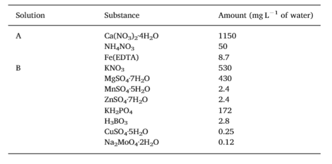
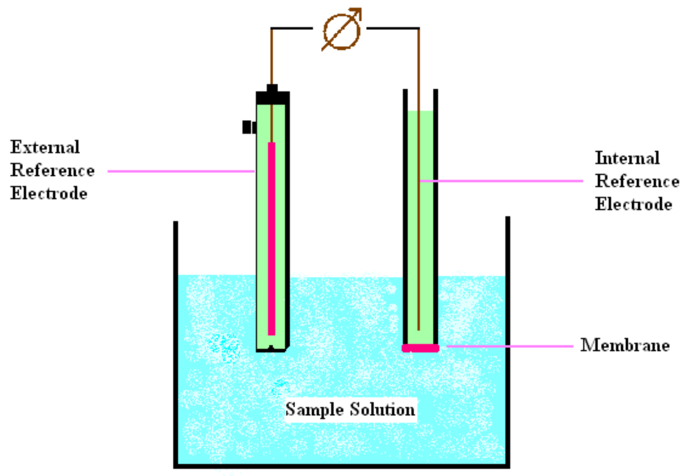
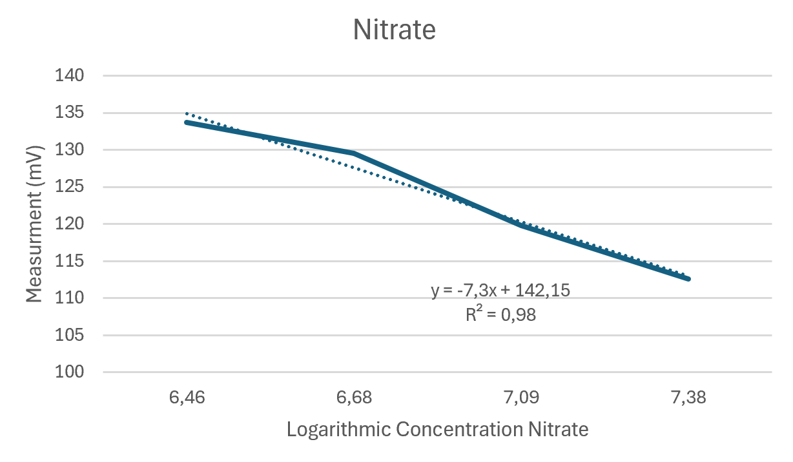
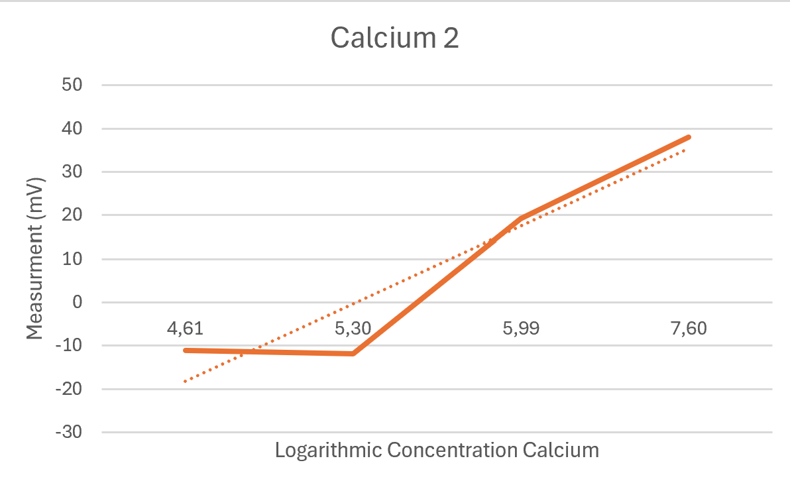
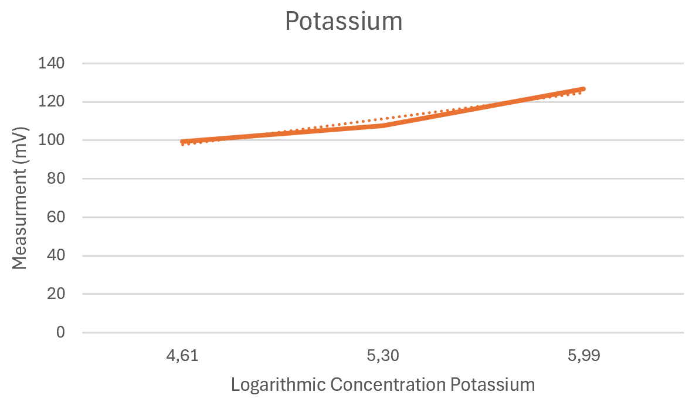

[**Home**](https://klaasmeersman.github.io/) - [**LEDs and PCB**](/inhoud/leds/) - [**LED Control and Sources**](/inhoud/aansturingLEDs/) - [**Energy Monitoring**](/inhoud/energiemonitoring/) - [**Water Supply**](/inhoud/aquaMonitoring/) - [**Dashboard**](/inhoud/dashboard/) - [**Modularity**](/inhoud/modulariteit/) - [**Plant Sensing**](/inhoud/plantensensor/) - [**Operation**](/inhoud/operation/) - [**Logbook**](/inhoud/logboek/)

---

# Vertical Farm
For the vertical farm, a hydroponics drip system has been chosen. This means that the plants are not grown in potting soil but in a substrate (here Rockwool). All necessary nutrients for the plants are provided in the water that is pumped to the plants. Consequently, it is important to be able to read the nutrient values from a water tank to dynamically replenish the nutrients in the water. This aqua monitoring consists of two main parts: reading the concentrations of the nutrients and automatically replenishing these nutrients.

# Required Nutrients

The nutrients for the plants, consisting of a series of chemical salts, are dissolved in water to obtain a concentrate. Two concentrates with different salts are prepared based on the following table with recommended values for growing bell pepper plants:

An A and B solution is made, each ten times as concentrated as the recommended values. This means that if we put ten times the recommended amount in 1 liter, we can still add 9 liters of water before reaching the ideal values. This allows small amounts to be pumped into the nutrient tank where the nutrients are electronically measured.

# Ion Sensors

The ion concentration of the nutrients (Ca2+, K+, and NO3-) is read using three sensors, each interacting with the same reference sensor. These 'Ion Selective Electrodes' can measure the concentration of specific ions with a selective membrane and display it as a potential difference (in mV).

These sensors need to be calibrated before use. The following ion concentrations are desired:

| Ion                        | Concentration (mg/l) | 
|:--------------------------:|:--------------------:|
| NO3- | 968                  |
| Ca2+            | 195                  |
| K+              | 254                  |

These sensors must be calibrated manually before they can perform a measurement. This involves reading standard salt solutions with different concentrations established by the sensor. The measured potential difference at each concentration will be plotted on a graph before drawing a line through it.

| Ion                       | Calibration Salt      | Low (mg/l) | Medium (mg/l) | High (mg/l) |
|:-------------------------:|:---------------------:|:----------:|:-------------:|:-----------:|
| NO3-| NaNO3      | 800        | 1200          | 1600        |
| Ca2+           | Ca(OH)2    | 100        | 200           | 400         | 
| K+             | KOH                   | 100        | 200           | 400         |

To achieve these low/medium/high concentrations, we make a separate stock solution of 1 liter for each sensor's corresponding salt. We aim for ion concentrations in the stock solution of 16g/l, 2g/l, and 2g/l for NO3-, Ca2+, and K+ respectively. The following formula can be used to calculate the mass of salt to be added:

Desired Salt Concentration = (Desired Ion Concentration) * (Molecular Mass Salt / Molecular Mass Ion)  
(MM = Molecular Mass)

| Ion                       | Calibration Salt    | Desired Salt Concentration (g/l) | MM Ion/MM Salt | Desired Ion Concentration Stock Solution (g/l) |
|:-------------------------:|:-------------------:|:--------------------------------:|:--------------:|:----------------------------------------------:|
| NO3-| NaNO3    | 21.93                            | 72.95%         | 16                                           | 
| Ca2+           | Ca(OH)2  | 1.0818                           | 54.09%         | 2                                            |
| K+             | KOH                 | 2.8699                           | 69.69%         | 2                                            |

If a lower volume of stock solution is desired, the masses to be added should be adjusted accordingly. For example, only 500 ml stock solution NO3- requires the addition of only 10.98 g NaNO3 to 500 ml H2O.

Next, we make the three different concentrations for each sensor's stock solutions by diluting them with deionized water:

|                      | NO3- | Ca2+        | K+          |
|:--------------------:|:--------------------------:|:----------------------:|:----------------------:|
| Parts Stock Solution | 1 part                     | 1 part                 | 1 part                 |
| Addition for High    | 9 parts H2O     | 4 parts H2O | 4 parts H2O |
| Addition for Medium  | 12 parts H2O    | 9 parts H2O | 9 parts H2O |
| Addition for Low     | 19 parts H2O    | 19 parts H2O| 19 parts H2O|

Once the three concentrations for a sensor are made, the 3-point calibration takes place. The reference ISE and the substance-specific ISE are successively placed in each of the three substance-specific concentrations and the voltage is measured.

From this, we find the following tables and graphs:

| mg/l NO3- | LN(mg/l NO3-) | mV    | Temperature (in °C) |
|:-------------------------------:|:-----------------------------------:|:-----:|:-------------------:|
| 640                             | 6.46                                | 133.7 | 22.8                |
| 800                             | 6.68                                | 129.5 | 22.4                |
| 1200                            | 7.09                                | 119.8 | 23.5                |
| 1600                            | 7.38                                | 112.6 | 23                  | 

 

| mg/l Ca2+ | LN(mg/l Ca2+) | mV    | Temperature (in °C) |
|:-------------------------------:|:-----------------------------------:|:-----:|:-------------------:|
| 100                             | 4.61                                | -11.1 | 25.7                |
| 200                             | 5.30                                | -11.9 | 25.9                |
| 400                             | 5.99                                | 19.2  | 26.2                |
| 2000                            | 7.60                                | 38.1  | 25.2                | 

 

| mg/l K+  | LN(mg/l K+) | mV    | Temperature (in °C) |
|:-------------------:|:----------------------:|:-----:|:-------------------:|
| 100                 | 4.61                   | 99.4  | 25.6                |
| 200                 | 5.30                   | 107.7 | 26.6                |
| 400                 | 5.99                   | 126.6 | 25.4                | 

 

(Add rights, explain rights -> adjustment possible + (code?))

This data and obtained rights can then be used to read the nutrient tank once with the sensors. The measured data is then fed back to the system via the Raspberry Pi using an ISE interface from the chemistry lab, a Consort C681. This calibration should be performed each time before

 reading the nutrient tank. This is because the ISEs are not designed for intensive use and can quickly deviate from their initial calibration values.

[Link to ISE code (USB connection to Raspberry Pi)](https://github.com/KlaasMeersman/KlaasMeersman.github.io/blob/main/inhoud/aquaMonitoring/ISE_UITLEZING.py)

# Nutrient Replenishment

After reading the three concentrations, the tank can be replenished with nutrient-rich concentrate using the peristaltic pump network.

The pumping of the concentrates will be adjusted so that the system can estimate the required amount of concentrates based on the measurement. Peristaltic pumps are known for delivering a constant flow rate. This has been experimentally verified with a few pumps:

|               | Pump 1 (Average after 10 measurements) | Pump 2 (Average after 10 measurements) |
|:-------------:|:-------------------------------------:|:-------------------------------------:|
| Time to 50 ml | 24.14 seconds                         | 21.84 seconds                         |
| Time to 100 ml| 50.42 seconds                         | 44.44 seconds                         |
| Flow Rate     | 120 ml/min                            | 135 ml/min                            |

The flow rate is fairly consistent for both pumps, although it is lower than described in the specifications (200 ml/min).

There are three pumps provided to pump water, nutrient solution A, and B into the water tank and six pumps that pump water from the water tank to each plant box.

After replenishing the water tank, a new measurement will take place to check if there has been any overshoot, in which case the tank would be diluted with water.

[Link to relays code](https://github.com/KlaasMeersman/KlaasMeersman.github.io/blob/main/inhoud/aquaMonitoring/Relays.cpp)

# Water Tank Level Control

To keep the water volume in the tank within limit values, we use a sonar module.

[Link to sonar module code](https://github.com/KlaasMeersman/KlaasMeersman.github.io/blob/main/inhoud/aquaMonitoring/Hoogtesensor.cpp)

# Possible Improvements

There are several aspects of the water supply that can still be optimized:

- Replace the current pipe network (mix and match) with uniform pipes and connectors to ensure equal flow to all boxes.
- Based on multiple growth cycles (with slightly varied parameters) of a plant species, search for the ideal nutrient composition for the plant species.