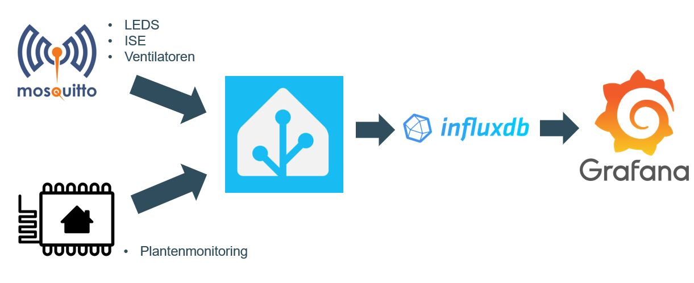
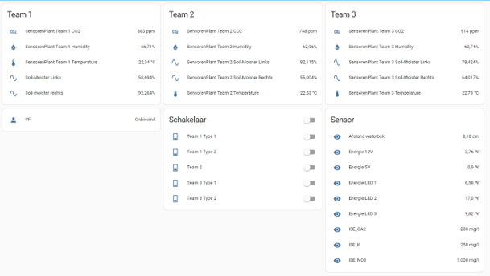
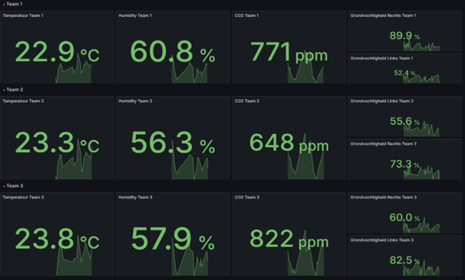
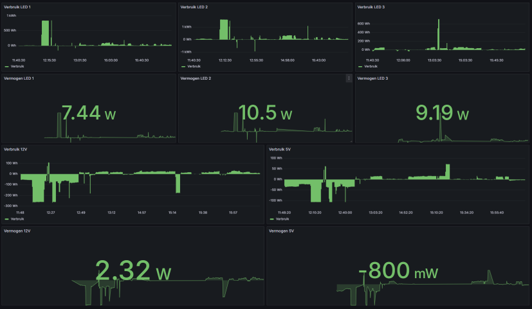
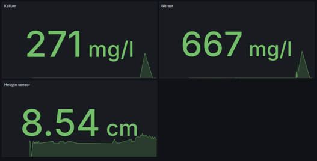

[**Home**](https://verticalfarmib3.github.io/) - [**LEDs and PCB**](/inhoud/leds/) - [**LED Control and Sources**](/inhoud/aansturingLEDs/) - [**Energy Monitoring**](/inhoud/energiemonitoring/) - [**Water Supply**](/inhoud/aquaMonitoring/) - [**Dashboard**](/inhoud/dashboard/) - [**Modularity**](/inhoud/modulariteit/) - [**Plant Sensing**](/inhoud/plantensensor/) - [**Operation**](/inhoud/operation/) - [**Logbook**](/inhoud/logboek/)

---

# Connections 

To get a dashboard with all our measerments we needed to connect all our devices. In the picture below we show how that works. You can see that all the actuators are using MQTT to get their data and also send data on topics. This is then send to our HomeAssistant that is used as a central gathering place for all the data. The data from our plantsensors is send to HomeAssistant with ESPHome, but there are also topics in MQTT for these parameters. Then all the data is stored in a database. We used influxdb as database. This in turn is linked to Grafana where we can diplay our data, calculate things, etc.

# Home Assistant

[Here](https://github.com/verticalfarmib3/verticalfarmib3.github.io/blob/main/inhoud/dashboard/config.yaml%20van%20homeassistant.txt) can you find a example of our config file for the HomeAssistant. There can you see that the mqtt and also how to implement the influxdb. On the picture below you can see how the HomeAssistant can look like. Or if you are on the CM3 network you can click [here](https://192.168.0.40:8123) to see it live. 

# Grafana 

<!--- This is how we connected the database to Grafana.
# -->
If then everything is setup. We can create dashboards to diplay our data. The pictures below give a example on how the diplays will look like. 

 
