[**Home**](https://verticalfarmib3.github.io/) - [**LEDs and PCB**](/inhoud/leds/) - [**LED Control and Sources**](/inhoud/aansturingLEDs/) - [**Energy Monitoring**](/inhoud/energiemonitoring/) - [**Water Supply**](/inhoud/aquaMonitoring/) - [**DashPCB**](/inhoud/dashPCB/) - [**Modularity**](/inhoud/modulariteit/) - [**Plant Sensing**](/inhoud/plantensensor/) - [**Operation**](/inhoud/operation/) - [**Logbook**](/inhoud/logboek/)

---

Bert Pyck

## Introduction
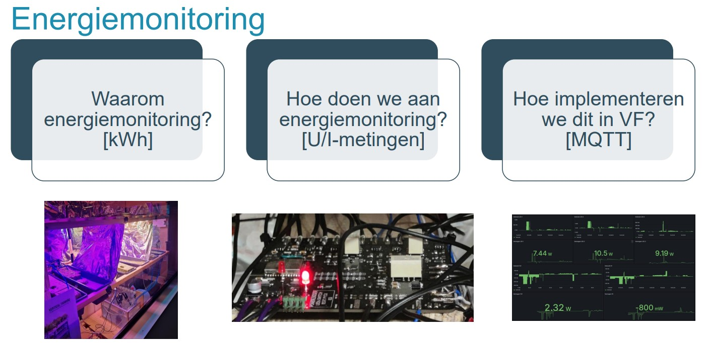

We ask ourselves three fundamental questions about energy monitoring: why do we do it, how do we perform it, and how do we implement this in a project? First, let's look at why we do energy monitoring. We want to know if our system is profitable enough and if everything is going as desired. How? We will create a PCB (explained below) that makes it possible to measure the voltage and current of various parts of the project. We can then use a microcontroller (µC) to calculate and transmit the power values and switch the relays. The last question is how we will implement this. The easiest and most robust way is via MQTT. We will send the calculated values to a broker, which will then place them in graphs. Thanks to MQTT, there can also be a reverse form of communication. This means it is possible to switch the LEDs via a broker or a mobile phone.

Below, everything will be explained about how the energy monitoring PCB is assembled and how we can wire and implement this correctly to measure accurate values.

## Description

The energy monitoring PCB is designed as a versatile solution for measuring and managing energy consumption in various applications. With a combination of advanced components, our PCB offers a comprehensive range of functionalities:

- The PCB is equipped with 8 current measurement chips (ACS712) and 8 voltage measurements via voltage dividers. This provides detailed information about both the current and the voltage of different parts of the project.
- Additionally, the PCB has 4 ADS1115 ADC I2C chips, each ADC having 4 channels multiplexed. This allows multiple voltage/current signals to be digitized.
- There are also 3 relays on the PCB, each with 2 switches. This makes it easy to switch specific LEDs on or off.
- The core of our energy monitoring PCB is the ESP32 microcontroller. This microcontroller not only provides the computational power to perform complex calculations but also ensures the calibration of the power.

## PCB

After the LEDs and power supplies were determined, we adjusted the energy monitoring PCB to meet the expectations. This is how we arrived at the functionalities described above. After some corrections and approval, we started creating the schematic, which can also be found on GitHub. Once the schematic was approved, we began designing the PCB.

In the photo below, you can see the steps we went through to achieve a working end result. The PCB is a 2-layer board with all components soldered on the top side. All pads on the outside are for guiding current to the current measurement chips or bringing voltage to the voltage dividers. It was important not to have a ground plane around as this can cause interference.

All components are SMD; there are no through-hole components, which makes soldering with a hot plate easier. Unfortunately, we did not have one available, making the soldering more complex.

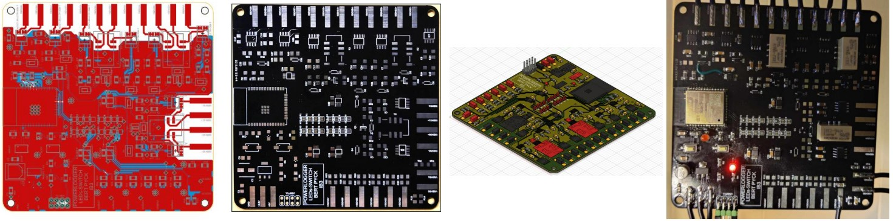
<iframe src="PCBs Bert (Type1, Type2, Powerlogger)/PowerLogger/PowerloggerBrd.pdf" width="100%" height="600px"></iframe>
<iframe src="PCBs Bert (Type1, Type2, Powerlogger)/PowerLogger/PowerloggerSch.pdf" width="100%" height="600px"></iframe>
[LINK TO THE FILES](https://github.com/verticalfarmib3/verticalfarmib3.github.io/tree/main/inhoud/energiemonitoring/PCBs%20Bert%20(Type1%2C%20Type2%2C%20Powerlogger)/PowerLogger)

## Operation
### Block Diagram

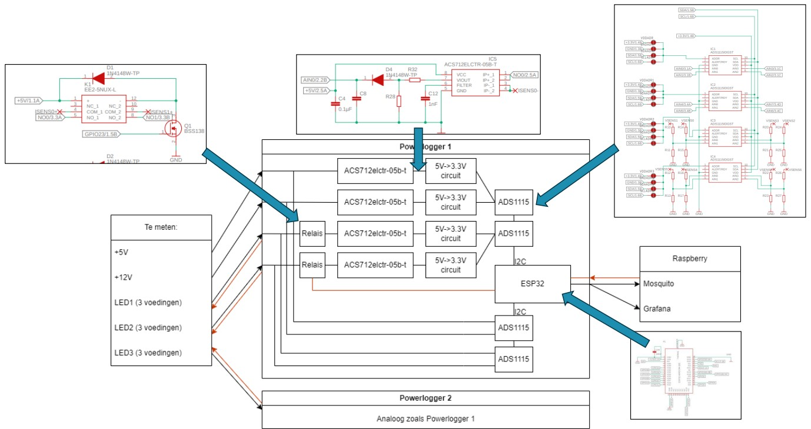

Above is the simple block diagram of the energy monitoring PCB. It is divided into different parts connected with arrows. On the left side of the diagram, you see the components to be measured: +5V, +12V, and the LEDs (3 power supplies for each LED). In the middle, you see the internal electronics of the energy monitoring PCB, and on the right side, you see the output that the PCB sends to, namely the MQTT broker and home-assistant.

The +5V and +12V are read and registered by the current chips (ACS712). These current chips are magnetic hall sensors that convert current up to 5A or -5A into a voltage in a linear manner. Since the current chips operate at +5V, the output of the current chip must be converted via a voltage divider to 3.3V so that the ADC can read and digitize this. The ADC then sends this information to the ESP32 via I2C.

For the LED power supplies, it first goes through a relay, allowing the LEDs to be turned on or off. The PCB has 4 ADCs, two for measuring and digitizing current and two for measuring or digitizing voltage. Thus, for each LED, there are 3 power supplies, and for each power supply, there is a relay, a current measurement circuit, and a voltage measurement circuit. To read the correct voltage, it is important to choose the right resistor values so that you have a MAXIMUM of 3.3+0.3V at the input of the ADC.

The ESP32 collects all the information, performs the necessary calculations, and sends this to the MQTT broker. This broker then sends the information to home-assistant. Conversely, the MQTT broker will push information to the ESP32, which can switch the LEDs on and off via the relays.

### Wiring for Correct Measurements

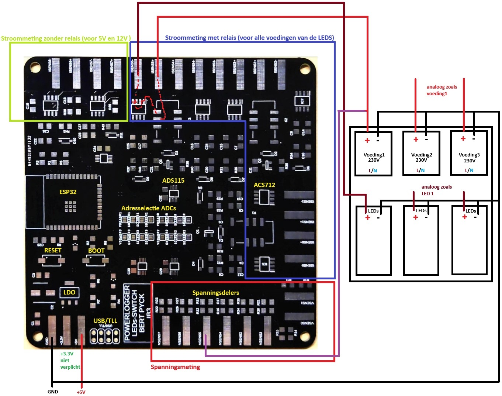

The energy monitoring PCB is divided into different measurement sections. The top left contains the current measurement without relays. This is intended to measure the +5V and +12V. To the right of this is the current section with relays. The bottom right is the voltage measurement with the correct resistor values as a voltage divider.

The measurement is comparable to connecting a multimeter. The current is placed in series, and the voltage in parallel. To measure the current, you need two paths: the incoming wire and the outgoing wire. This path can be interrupted by the relays and connections on the PCB for 6 measurements. This works similarly for the voltage measurement but with the difference that you measure the voltage at only one point because the other connection is connected to the ground via the voltage divider (YOU MEASURE VOLTAGE ACROSS SOMETHING)!

Make sure all grounds are connected correctly for a proper measurement.

## Components + Control Explanation
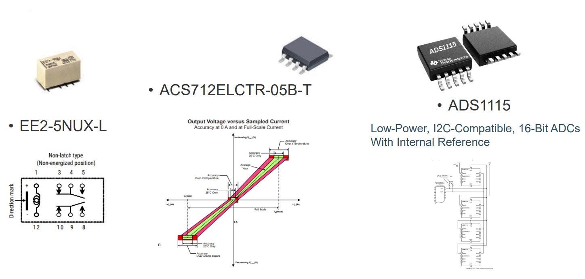

Below, the fundamental components for power measurement, including the microcontroller, are clearly discussed.

### EE2-5NUX-L Relay
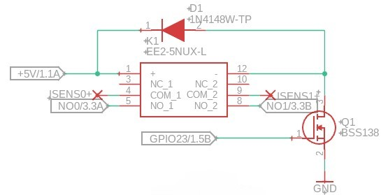

The EE2-5NUX-L is a miniature relay designed for applications where reliability and compactness are important. This relay has a coil voltage of 5V and offers high sensitivity with low power consumption. The relay is double-pole double-throw (DPDT), which means it can switch two separate circuits. With a switching frequency of up to 300 operations per minute and an insulation resistance of at least 1000 MΩ, the EE2-5NUX-L is ideal for use in telecommunications equipment, measuring instruments, and other electronic systems.

A diode is placed antiparallel over the coil connectors for the correct protection of the relay. The circuit should be controlled with an N-type MOSFET, as the drive voltage and current of the relay are higher than that of the ESP32.

### ADS1115 ADC (Analog-to-Digital Converter)
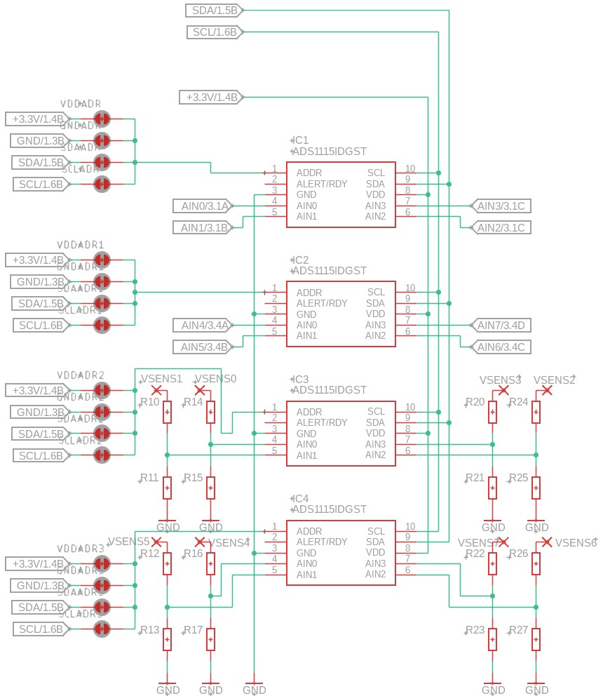

The ADS1115 is a 16-bit analog-to-digital converter (ADC) from Texas Instruments. It features four channels multiplexed to one ADC that can perform single-ended or differential measurements. The ADC has a programmable gain amplifier, low power consumption, and an internal reference voltage. With an I²C interface, the ADS1115 is easy to integrate into microcontroller systems like the ESP32.

You can control up to four ADS1115 ADCs via I²C on one bus. Each of the four ADCs must have a unique address to communicate with. This can be set with the solder pads on the energy monitoring PCB. Ensure that each ADC gets a different address by never using the same combination of solder pads.

### ACS712 5A
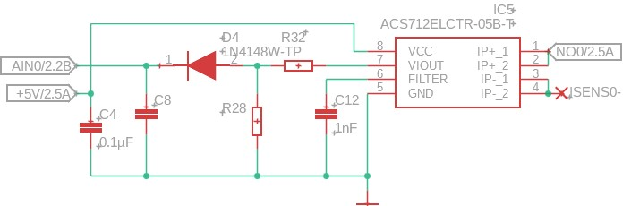

The ACS712ELCTR-05B-T is a current sensor that allows accurate AC and DC current measurements. The sensor has a built-in magnetic hall-effect meter that detects current through a conductive path and converts it into a proportional analog output signal. The linear relationship between the measured current and the output voltage is an important feature of the ACS712. For the 5A variant, the sensor provides an output voltage of 185 mV per A, meaning a change in the measured current directly leads to a proportional change in the output voltage, making the readings simple and accurate for a microcontroller to read. Since it can measure AC from -5A to +5A, the output of the ACS712 at 0A is 2.5V. This must be converted via a voltage conversion circuit to a readable corresponding voltage so that the ADC can read and digitize it.

### 5V->3.3V Converter

The left circuit in the photo above ensures proper voltage conversion. The ACS712 operates at 5V and gives an output voltage of 2.5V at 0A. Since the ADC operates at 3.3V, we expect an output voltage of about 1.65V at 0A. Therefore, voltage conversion is necessary. The circuit functions as a voltage divider. Behind the voltage divider, a diode is placed to ensure a voltage drop of 0.7V and one-way signal direction.

Generally, the circuit provides a conversion from 0V-5V to 0V-3.3V, making the signal readable for the ADC.

### ESP32

The ESP32 is a powerful and versatile microcontroller from Espressif Systems, featuring integrated Wi-Fi and Bluetooth. It has a dual-core processor, extensive GPIO pins, analog and digital interfaces, and various communication protocols such as UART, SPI, and I2C.

## MQTT
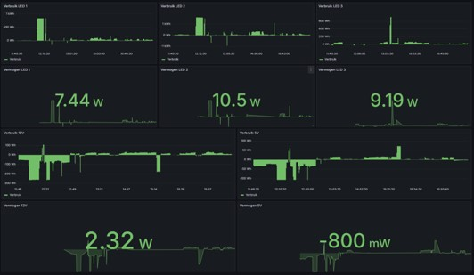

## Code

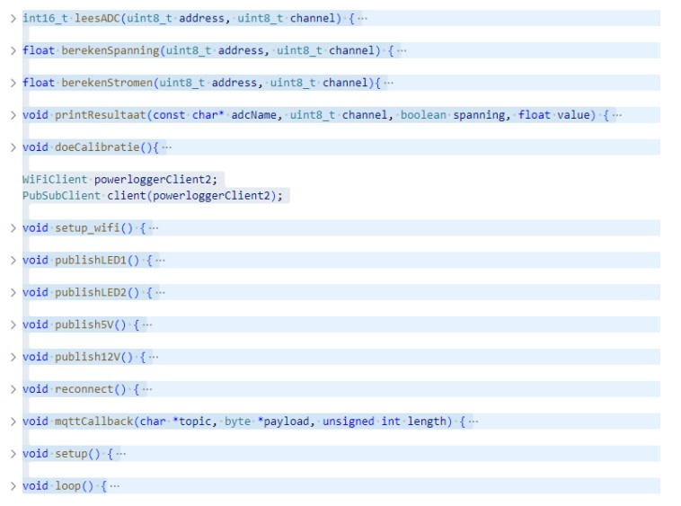

Comments are in the code.

## Conclusion

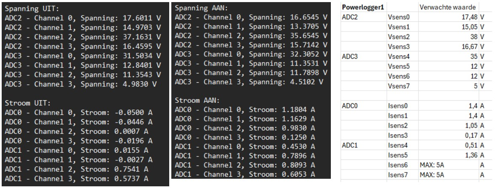

On the left are the measured values via USB/TLL (UART) and on the right are the expected values calculated for LED1 with Excel.

<video width="320" height="240" controls>
  <source src="demo.mp4" type="video/mp4">
  Your browser does not support the video tag.
</video>
