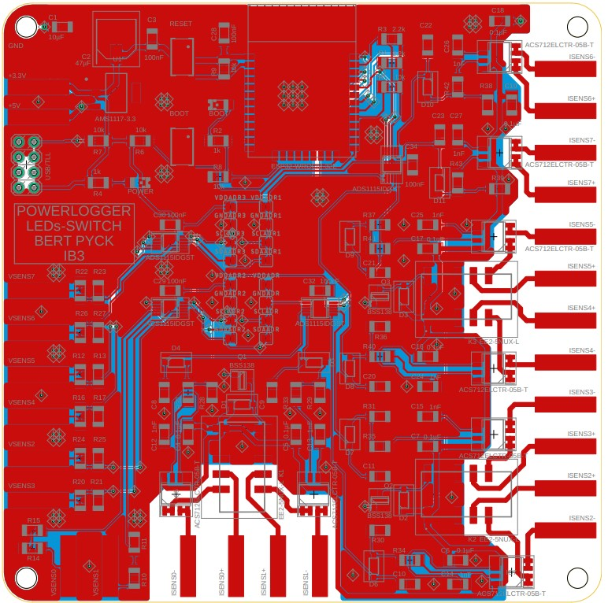

[**LEDs en PCB**](/inhoud/leds/) - [**LED-aansturing en bronnen**](/inhoud/aansturingLEDs/) - [**Energiemonitoring**](/inhoud/energiemonitoring/) - [**Watervoorziening**](/inhoud/aquaMonitoring/) - [**Dashboard**](/inhoud/dashboard/) - [**Modulariteit**](/inhoud/modulariteit/) - [**Plantenmonitoring**](/inhoud/plantensensor/) - [**Operation**](/inhoud/operation/) - [**Logboek**](/inhoud/logboek/)

---

## Inleiding

We stellen onszelf drie fundamentele vragen over energiemonitoring: waarom doen we eraan, hoe voeren we het uit en hoe implementeren we dit in een project? Laten we eerst kijken naar waarom we energiemonitoring doen. We willen weten of ons systeem rendabel genoeg is en of alles naar wens verloopt. Hoe? We gaan een bordje maken (hieronder uitgelegd) dat het mogelijk maakt om van verschillende delen van het project de spanning en de stroom te meten. Vervolgens kunnen we een microcontroller (µC) gebruiken om de vermogenswaarden te berekenen en door te sturen en de relais te schakelen. De laatste vraag is hoe we dit zullen implementeren. De gemakkelijkste en meest robuuste manier is via MQTT. We zullen de berekende waarden doorsturen naar een broker, die ze vervolgens in grafieken zal plaatsen. Dankzij MQTT kan er ook een omgekeerde vorm van communicatie zijn. Dit betekent dat het via een broker of gsm mogelijk is om de LED's te schakelen.

Hieronder zal alles worden uitgelegd over hoe het energiemonitoringsbordje in elkaar zit en hoe we dit op een juiste manier kunnen bedraden en implementeren om correcte waarden te meten.

## Beschrijving

Het energiemonitoringsbordje is ontworpen als een veelzijdige oplossing voor het meten en beheren van energieverbruik in diverse toepassingen. Met een combinatie van geavanceerde componenten biedt ons bordje een uitgebreid scala aan functionaliteiten:

- Het bordje is uitgerust met 8 stroom-meetchips (ACS712) en 8 spanningsmetingen via spanningsdelers. Hiermee wordt gedetailleerde informatie verkregen over zowel de stroomsterkte als de spanning van verschillende delen van het project.
- Daarnaast beschikt het bordje over 4 ADS1115 ADC I2C chips, waarbij elk ADC, 4 kanalen multiplext. Hierdoor kunnen meerdere spannings/stroom-signalen worden gedigitaliseerd.
- Er zijn ook 3 relais aanwezig op het bordje, elk met 2 schakelaars. Hiermee kunnen specifieke LEDs eenvoudig aan- of uitgeschakeld worden.
- De kern van ons energiemonitoringsbordje wordt gevormd door de ESP32 microcontroller. Deze microcontroller biedt niet alleen de rekenkracht om complexe berekeningen uit te voeren, maar zorgt ook voor de kalibratie van het vermogen.

## Schema & PCB

Nadat de LED's en de voedingen bekend waren, hebben we het energiemonitoringsbordje aangepast aan de verwachtingen. Zo zijn we tot de functionaliteiten gekomen die hierboven beschreven zijn. Na enige correcties en goedkeuring zijn we aan de slag gegaan met het maken van het schema, dat ook te vinden is op GitHub. Nadat het schema was goedgekeurd, zijn we begonnen met het ontwerpen van de PCB.

Op de foto hieronder ziet u de stappen die we hebben doorlopen om tot een werkend eindresultaat te komen. De PCB is een 2-laags PCB waarbij alle componenten aan de bovenkant gesoldeerd zijn. Alle pads aan de buitenkant dienen om stroom naar de stroommeetchips te leiden of spanning naar de spanningsdelers te brengen. Het was belangrijk om geen groundplane rondom te hebben, omdat dit interferentie kan veroorzaken.

Alle componenten zijn SMD, er zijn geen through hole componenten, wat het solderen met een warmteplaat gemakkelijker maakt. Helaas hadden we deze niet tot onze beschikking, waardoor het solderen complexer werd.

[LINK NAAR DE FILES](https://github.com/KlaasMeersman/KlaasMeersman.github.io/tree/main/inhoud/energiemonitoring/PCBs%20Bert%20(Type1%2C%20Type2%2C%20Powerlogger)/PowerLogger)
## Werking
### Blokschema

Hierboven zie je het eenvoudige blokschema van het energiemonitoringsbordje. Het is onderverdeeld in verschillende delen, verbonden met pijlen. Aan de linkerkant van het schema zie je de te meten componenten:+5V, +12V en de LED's (Per LED 3 voedingen). In het midden zie je de interne elektronica van het energiemonitoringsbordje, en aan de rechterkant zie je de uitgang dat het bordje naar stuurt, namelijk de MQTT-broker en home-assistant. 

De +5V en +12V worden binnen gelezen en geregistreerd door de stroomchips (ACS712). Deze stroomchips zijn magnetische hall-sensoren die op een lineaire manier stroom tot 5 ampère of -5 ampère omzetten naar een spanning. Aangezien de stroomchips op +5V volt werken, moet de output van de stroomchip via een spanningsdeler worden omgezet naar 3.3V zodat de ADC dit kan binnenlezen en digitaliseren. De ADC stuurt deze informatie vervolgens door naar de ESP32 via I2C.

Voor de voedingen van de LED's gaat het eerst door een relais, waardoor het mogelijk is om de LED's aan of uit te zetten. Op het bord zijn 4 ADC's aanwezig, waarvan twee voor het meten en digitaliseren van stroom en twee voor het meten of digitaliseren van spanning. Zo is er voor iedere LED 3 voedingen, en voor iedere voeding is er een relais, een stroomcircuitmeting en een spanningscircuitmeting aanwezig. Voor de correcte spanning te lezen is het belangerijk dat je de juiste weerstandswaarden kiest zodat je MAXIMAAL 3.3+0.3V aan de ingang van ADC hebt.

De ESP32 neemt alle informatie op, voert de benodigde berekeningen uit en stuurt deze door naar de MQTT-broker. Deze broker stuurt de informatie vervolgens door naar home-assistant. Omgekeerd zal de MQTT-broker informatie pushen naar de ESP32, die via de relais de LED's aan en uit kan zetten.

### Bedrading voor correcte metingen

Het Energy energiemonitoringsbordje is onderverdeeld in verschillende meetgedeelten. Links bovenaan bevindt zich de stroommeting zonder relais. Dit is bedoeld om de +5V en +12V te meten. Rechts daarvan bevindt zich het stroomgedeelte met relais. Rechtsonder is de spanningsmeting met de juiste weerstandswaarden als spanningsdeler.

De meting is vergelijkbaar met het aansluiten van een multimeter. De stroom wordt in serie geplaatst en de spanning in parallel. Om de stroom te meten, heeft u twee paden nodig: de inkomende draad en de uitgaande draad. Dit pad kan worden onderbroken door de relais en verbindingen op het bordje voor 8 metingen. Dit werkt op een vergelijkbare manier voor de spanningsmeting, maar met het verschil dat je de spanning slechts op één punt meet omdat de andere verbinding via de spanningsdeler verbonden is met de gnd (SPANNING MEET JE OVER IETS)!

Zorg ervoor dat alle grounds correct verbonden zijn, zodat er een correcte meting kan plaatsvinden.

## Componenten

### ADS1115 ADC (Analog-to-Digital Converter)

...

### ACS712 5A

...

### 5V->3.3V converter

...

### ESP32

...

## MQTT

## Code

...

## Slot

<video width="320" height="240" controls>
  <source src="demo.mp4" type="video/mp4">
  Your browser does not support the video tag.
</video>
