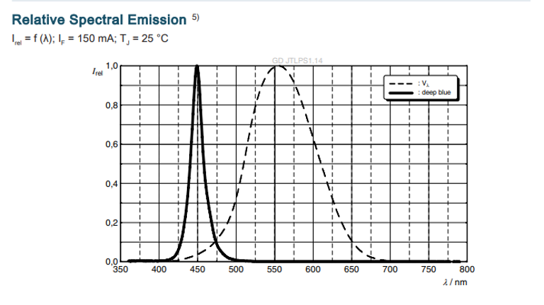
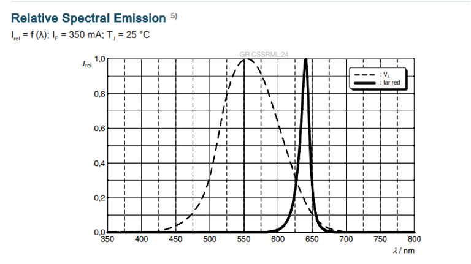
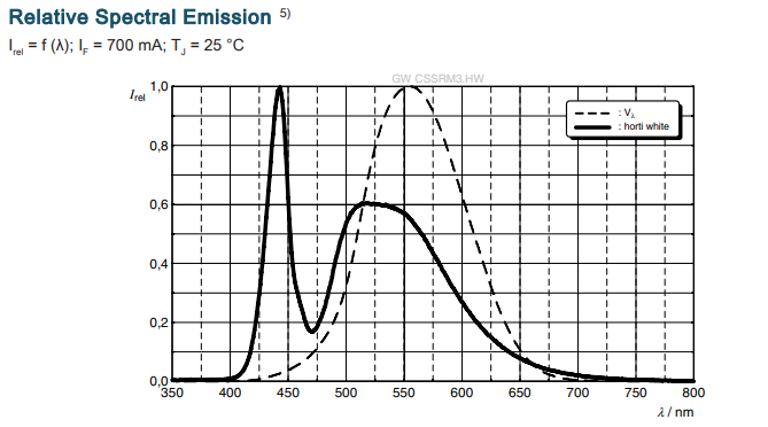
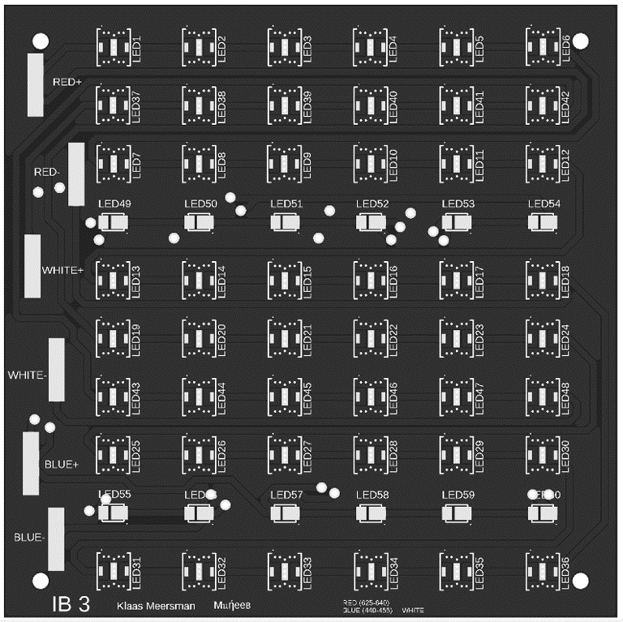
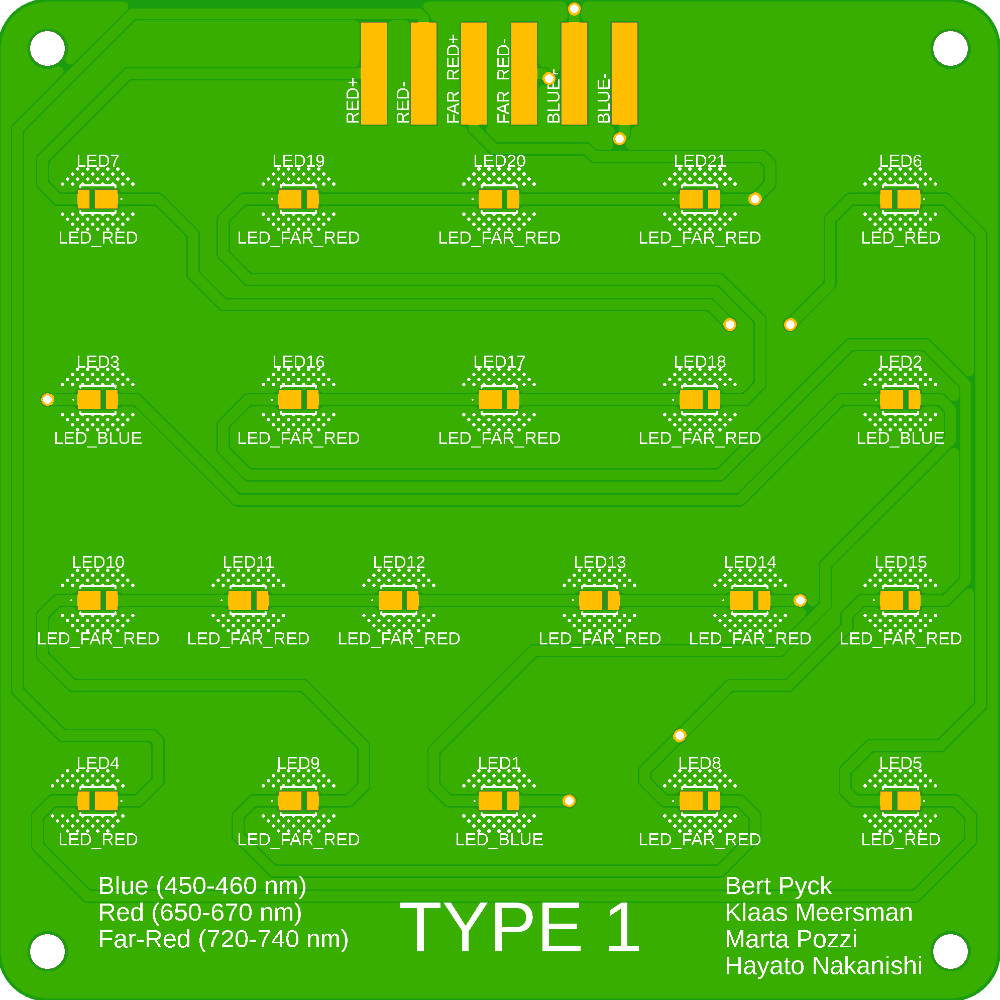

[**LEDs en PCB**](/inhoud/leds/) - [**LED-aansturing en bronnen**](/inhoud/aansturingLEDs/) - [**Energiemonitoring**](/inhoud/energiemonitoring/) - [**Watervoorziening**](/inhoud/aquaMonitoring/) - [**Dashboard**](/inhoud/dashboard/) - [**Modulariteit**](/inhoud/modulariteit/) - [**Plantenmonitoring**](/inhoud/plantensensor/) - [**Operation**](/inhoud/operation/) - [**Logboek**](/inhoud/logboek/)

---

# Rechter LED-array: Yuta en Jualiang

De volgende selectie van LEDs is gemaakt door Yuta en Jialiang:

* Blauw: 12  (440-450nm)
* Rood: 12  (650-670nm)
* Infrarood: 12  (720-740nm)
* Wit: 72

[Datasheet](https://otmm.lumileds.com/adaptivemedia/f0665283471a2a639ce8c3006456265ad074bde9)

De keuze voor de LED's wordt als volgt veklaard:
<iframe src="Proposal_of_LED_from_Yuta_Leo.pdf" width="100%" height="600px"></iframe>

Er worden 2 identieke PCB's gebruikt om het beoogde aantal LED's aan te sturen.

---

# Midden LED-array: M𝔲ήeeв
De volgende selectie van LEDs is gemaakt door M𝔲ήeeв:

* [Blauw](https://look.ams-osram.com/m/1b72a5b7addd47df/original/GD-JTLPS1-14.pdf): 24  (455nm)
* [Rood](https://look.ams-osram.com/m/38e03c91ab328b02/original/GR-CSSRML-24.pdf): 72  (630nm)
* [Wit](https://www.mouser.be/datasheet/2/588/prd_pim_datasheet_15127216_EN_pdf-3388640.pdf): 24

De keuze voor de LED's wordt niet verklaard. Vermoedelijk wordt er gegaan voor een rood/blauw ratio van 3/1. Een deel van het blauw wordt gehaald uit de witte LEDs die ook een piek hebben bij de golflengtes equivalent aan blauw.

| Blauw                      |Rood                        |Wit                           | 
|:--------------------------:|:--------------------------:|:----------------------------:|
| |  |  |

Er worden 2 identieke PCB's gebruikt om het beoogde aantal LED's aan te sturen.

---

# Linker LED-array: Marta Pozzi en Hayato Nakanishi

De volgende selectie van LEDs is gemaakt door Marta en Hayato:

* [Blauw](https://www.mouser.be/ProductDetail/Cree-LED/JE2835ARY-N-0002A0000-N0000001?qs=tlsG%2FOw5FFjsuj%2F2f9X0HQ%3D%3D): 11 (450-460nm)
* [Rood](https://www.mouser.be/ProductDetail/Cree-LED/JE2835AHR-N-0001A0000-N0000001?qs=tlsG%2FOw5FFjj3bMznpJhRA%3D%3D): 17  (650-670nm)
* [Infrarood](https://www.mouser.be/ProductDetail/Cree-LED/JE2835AFR-N-0001A0000-N0000001?qs=tlsG%2FOw5FFhxeS5Ond46kw%3D%3D): 55  (720-740nm)

[Datasheet](https://www.mouser.be/datasheet/2/723/JSeries_2835_Color-3359504.pdf)

De keuze voor de LED's wordt als volgt veklaard:
<iframe src="LED_selection_proposal_document.pdf" width="100%" height="600px"></iframe>

Er werden 2 types PCB gebruikt om de LED's aan te sturen. De LED-array bestaat uit 3 keer type 1 en éénmaal type 2.

Volgende PCB werd ontworpen:

