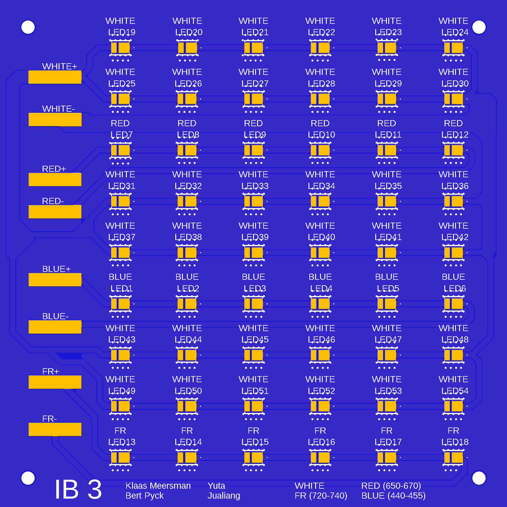

[**Home**](https://klaasmeersman.github.io/) - [**LEDs and PCB**](/inhoud/leds/) - [**LED Control and Sources**](/inhoud/aansturingLEDs/) - [**Energy Monitoring**](/inhoud/energiemonitoring/) - [**Water Supply**](/inhoud/aquaMonitoring/) - [**Dashboard**](/inhoud/dashboard/) - [**Modularity**](/inhoud/modulariteit/) - [**Plant Sensing**](/inhoud/plantensensor/) - [**Operation**](/inhoud/operation/) - [**Logbook**](/inhoud/logboek/)

---

# Right LED Array: Yuta and Jualiang

The following selection of LEDs was made by Yuta and Jialiang:

* Blue: 12  (440-450nm)
* Red: 12  (650-670nm)
* Far red: 12  (720-740nm)
* White: 72

[Datasheet](https://otmm.lumileds.com/adaptivemedia/f0665283471a2a639ce8c3006456265ad074bde9)

The choice for the LEDs is explained as follows:
<iframe src="Proposal_of_LED_from_Yuta_Leo.pdf" width="100%" height="600px"></iframe>

Two identical [PCBs](https://github.com/VerticalFarmIB3/VerticalFarmIB3.github.io/tree/main/inhoud/leds/eaglefiles/yuta_jualiang) are used to place the intended number of LEDs.

---

# Middle LED Array: Muneeb
The following selection of LEDs was made by Muneeb:

* [Blue](https://look.ams-osram.com/m/1b72a5b7addd47df/original/GD-JTLPS1-14.pdf): 24  (455nm)
* [Red](https://look.ams-osram.com/m/38e03c91ab328b02/original/GR-CSSRML-24.pdf): 72  (630nm)
* [White](https://www.mouser.be/datasheet/2/588/prd_pim_datasheet_15127216_EN_pdf-3388640.pdf): 24

The choice for the LEDs is not explained. Presumably, a red/blue ratio of 3/1 is used. Some of the blue is obtained from the white LEDs, which also have a peak at wavelengths equivalent to blue.

| Blue                      | Red                        | White                           | 
|:--------------------------:|:--------------------------:|:----------------------------:|
| |  |  |

Two identical [PCBs](https://github.com/VerticalFarmIB3/VerticalFarmIB3.github.io/tree/main/inhoud/leds/eaglefiles/muneeb) are used to place the intended number of LEDs.

---

# Left LED Array: Marta Pozzi and Hayato Nakanishi

The following selection of LEDs was made by Marta and Hayato:

* [Blue](https://www.mouser.be/ProductDetail/Cree-LED/JE2835ARY-N-0002A0000-N0000001?qs=tlsG%2FOw5FFjsuj%2F2f9X0HQ%3D%3D): 11 (450-460nm)
* [Red](https://www.mouser.be/ProductDetail/Cree-LED/JE2835AHR-N-0001A0000-N0000001?qs=tlsG%2FOw5FFjj3bMznpJhRA%3D%3D): 17  (650-670nm)
* [Far red](https://www.mouser.be/ProductDetail/Cree-LED/JE2835AFR-N-0001A0000-N0000001?qs=tlsG%2FOw5FFhxeS5Ond46kw%3D%3D): 55  (720-740nm)

[Datasheet](https://www.mouser.be/datasheet/2/723/JSeries_2835_Color-3359504.pdf)

The choice for the LEDs is explained as follows:
<iframe src="LED_selection_proposal_document.pdf" width="100%" height="600px"></iframe>

Two types of PCBs were used to place the LEDs. The LED array consists of three [type 1](https://github.com/KlaasMeersman/KlaasMeersman.github.io/tree/main/inhoud/energiemonitoring/PCBs%20Bert%20(Type1%2C%20Type2%2C%20Powerlogger)/Type1) and one [type 2](https://github.com/KlaasMeersman/KlaasMeersman.github.io/tree/main/inhoud/energiemonitoring/PCBs%20Bert%20(Type1%2C%20Type2%2C%20Powerlogger)/Type2).

The following PCB was designed:

