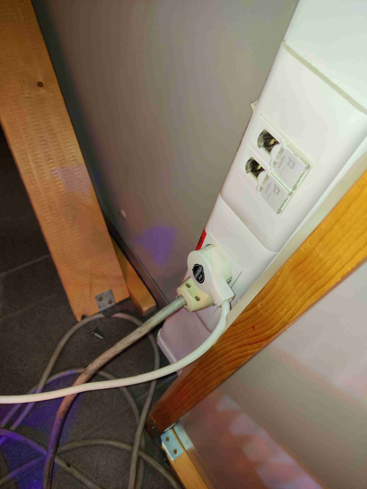
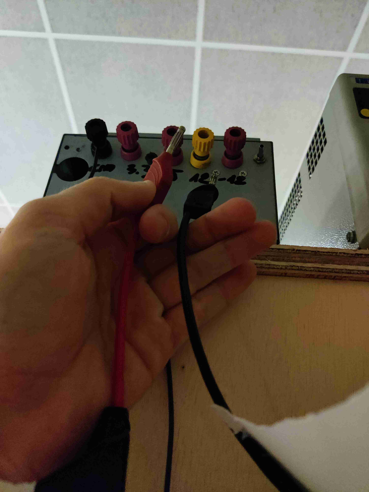
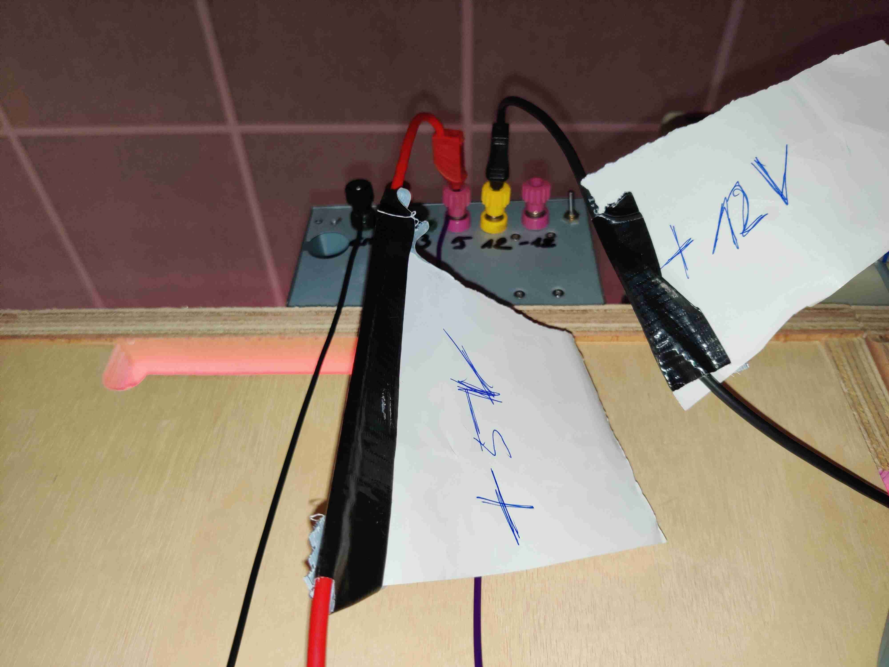
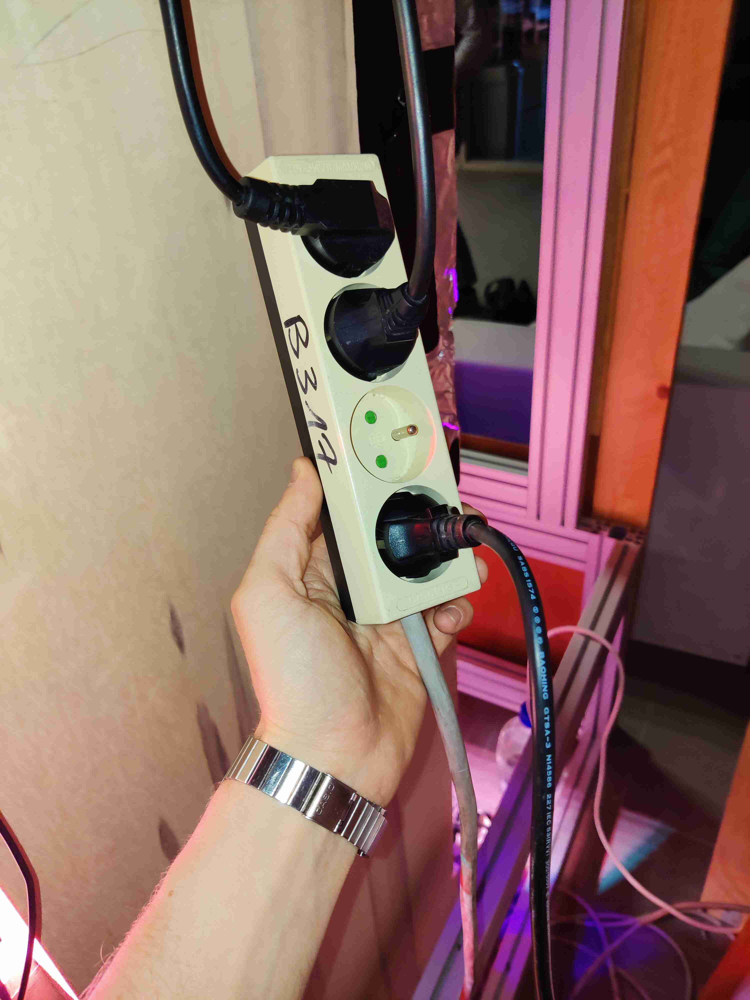
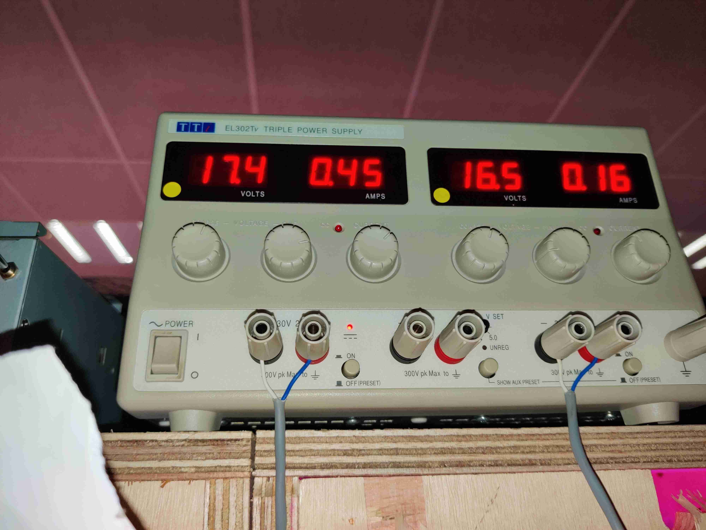
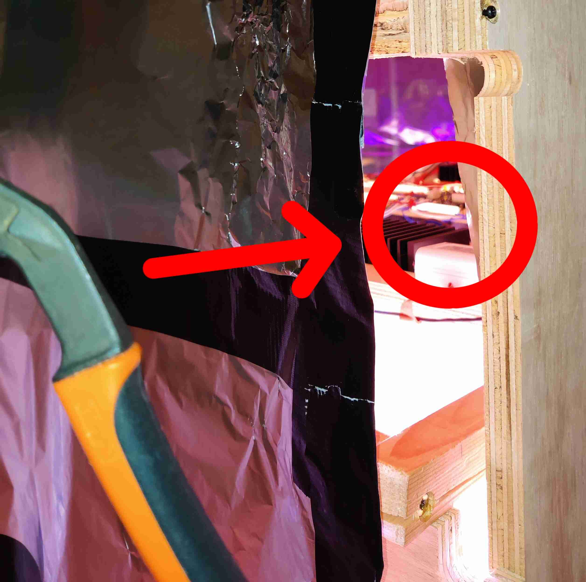

[**Home**](https://verticalfarmib3.github.io/) - [**LEDs and PCB**](/inhoud/leds/) - [**LED Control and Sources**](/inhoud/aansturingLEDs/) - [**Energy Monitoring**](/inhoud/energiemonitoring/) - [**Water Supply**](/inhoud/aquaMonitoring/) - [**Dashboard**](/inhoud/dashboard/) - [**Modularity**](/inhoud/modulariteit/) - [**Plant Sensing**](/inhoud/plantensensor/) - [**Operation**](/inhoud/operation/) - [**Logbook**](/inhoud/logboek/)

---

# Steps to Power On VF
## Step 1:
Normally, the lower plug (Raspberry Pi) is still in, only insert the upper plug into the socket.

## Step 2:
Turn on the source with the switch on the right (**switch up --> ON**, **switch down --> OFF**).
**WAIT** until you hear **ALL** relays switch (+5 sec), do **NOT** insert the +5V and +12 connectors yet!

## Step 3:
Once **ALL** relays have switched, you may insert the connectors into the correct connectors on the power supply. Now the board is ready for measurements. If you insert the connectors for switching the relays, no accurate measurements will take place.

## Step 4:
Now you can also turn on the high voltage, so plug the rightmost 230V cable into the power strip, and the **correctly set** power supply can be turned on using the two 'on' buttons at the bottom.

## Machine is ON + measuring correctly

## Shutting Down
The rightmost relay may stick due to high input current. This causes the internal relay pins to weld together. If this happens, a gentle tap with pliers on the relay may be given.

# Dashboard and Passwords Explanation

The Vertical Farm in the building was set up using a Raspberry Pi. A USB stick on it provides the Internet connection. It is important to check this because otherwise the services will not work. The IP address should normally be 192.168.0.40. The following table is a summary of all ports and logins so you can access everything if needed.

| name             | port | username | password     |
|:----------------:|:----:|:--------:|:------------:|
| HomeAssistant    | 8123 | VF       | IB3          |
| ESPHome          | 6052 | /        | /            |
| Mosquitto Broker | 1883 | VF       | IB3          |
| Grafana          | 3000 | admin    | admin        |
| InfluxDB         | 8086 | VF       | WelcomeToVF  |