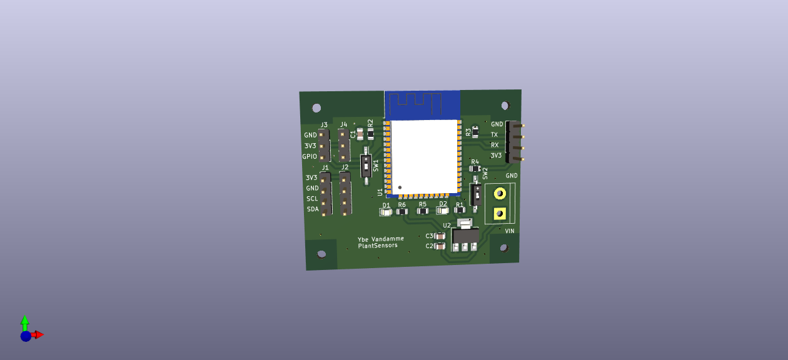

[**LEDs en PCB**](/inhoud/leds/) - [**LED-aansturing en bronnen**](/inhoud/aansturingLEDs/) - [**Energiemonitoring**](/inhoud/energiemonitoring/) - [**Watervoorziening**](/inhoud/aquaMonitoring/) - [**Dashboard**](/inhoud/dashboard/) - [**Modulariteit**](/inhoud/modulariteit/) - [**Plantenmonitoring**](/inhoud/plantensensor/) - [**Operation**](/inhoud/operation/) - [**Logboek**](/inhoud/logboek/)

---

Hier kunnen jullie alles terug vinden i.v.m. het plantenmonitoring. Zoals schema's, PCB ontwerp, datasheets etc. 

Voor de planten werden 2 verschillende soorten PCB's gemaakt. De PCB die instaat voor het aansturen van de ventilatoren is de zelfde als bij de pompen voor het water. Meer informatie en design kunt u [daar](../aquaMonitoring/index.md) vinden. De 2e soort PCB werd door ons ontworpen. De PCB's die we ontworpen hebben kunnen voorzien worden van twee SCD40 sensoren en twee grond-vochtigheidsensoren. We hebben echter besloten om slechts 1 SCD40 sensor per bordje aan te sluiten door het dure prijskaartje van de sensor. Aan de hand van de SCD40 kan de CO2, temperatuur en vochtigheid van de lucht gemeten worden. Deze zijn cruciaal voor de groei van de planten en moeten dus gemonitord worden. Zo kunnen de waarden bijgestuurd worden als ze niet goed zijn voor de plantengroei. De grond-vochtigheidsensor kan gebruikt worden om de meten hoe vochtig de grond is en zo de planten extra of minder water de geven.

# Ventilatoren
Er zijn 6 ventilatoren aanwezig, voor elke plantenbak 1. Het hoofddoel van de ventilatoren is zorgen voor de stevigheid van de planten. Er moet wat wind aanwezig zijn om een sterke stengel te krijgen. We hebben gekozen om de ventilatoren op elk uur 10min te laten draaien. Daarnaast beïnvloeden de ventilatoren ook de temperatuur en luchtvochtigheid. Als het warmer wordt dan 28°C op 1 van de 3 SCD40 sensoren zullen de ventilatoren ook aanschakelen. Daarnaast zullen ze ook aanschakelen als de luchtvochtigheid bij 1 van de sensoren groter wordt dan 90%. De ventilatoren die we gebruiken werden uit oude computers gedemonteerd en hebben dus geen geld gekost. Ze werken op 12V, deze 12V wordt geschakeld aan de hand van een PCB met een relais.

# SCD40

Met de SCD40 kunnen er in de vertical farm CO2, temperatuur en luchtvochtigheid metingen gebeuren. De CO2 metingen hebben een range van 400-2000 ppm. Hierbij is er een accuracy van +-50 ppm +5% reading bij het interval 400 ppm-2000ppm. De luchtvochtigheidmetingen hebben een accuracy van +-6%. Als laatste heeft de temperatuur ook een cruciale rol is in het groeien van planten. Deze heeft een range van -10°C- 60°C en een nauwkeurigheid van 0,8°C. De communicatie van deze sensor gebeurd via I2C. Deze sensoren worden aangesloten aan onze zelf ontworpen PCB en werkt met een voedingsspanning van 3,3V. Deze sensoren werden besteld op Tinytronics en hadden een kostprijs van 22 euro, we gebruiken er drie dus dat maakt 66 euro.

# Grondsensor

Aan de hand van de grondsensor wordt de vochtigheid van het substraat (rockwool) gemeten. Zo kan gezien worden wanneer het substraat te droog is en er dus water moet gegeven worden aan de planten. Deze grondsensor voert capacitieve metingen uit en is ook aangesloten op de zelf ontworpen PCB en werkt net zoals de SCD40 op een voedingsspanning van 3,3V. Deze sensoren werden net als de SCD40 besteld op Tinytronics en hadden en kostprijs van 4 euro, hiervan hebben we er 6 besteld dus dat maakt 24 euro.

# PCB-design

<iframe src="schematic.pdf" width="100%" height="600px"></iframe>

# Yaml Files 
[Download soil-moisture.yaml](soil-moisture.yaml)
[Download ventilator.yaml](ventilator.yaml)
